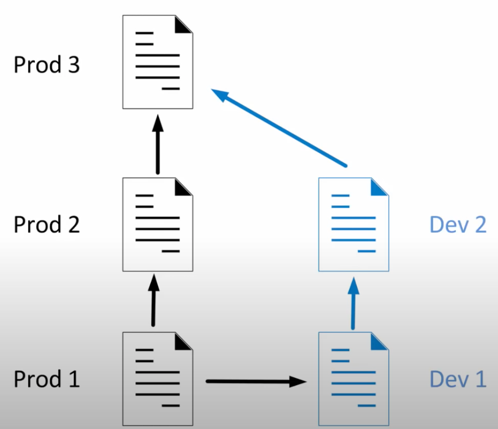
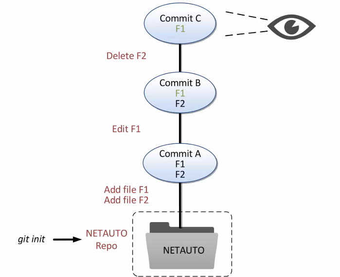

# 04-01: Introduction to Git

What we will cover:
+ [04-01: Introduction to Git](#04-01-introduction-to-git)
    + [Git](#git)
    + [Important Graphs](#important-graphs)
        + [Commit Graph](#commit-graph)
        + [Conceptual Areas](#conceptual-areas)
    + [DIY](#diy)
        + [1: Create a New Repo](#1-create-a-new-repo)
        + [2: Git Username and Email](#2-git-username-and-email)
        + [3: Stage Commits](#3-stage-commits)
            + [Initial Commit](#initial-commit)
            + [Adding New Files](#adding-new-files)
            + [Removing Files](#removing-files)
            + [Undoing a Working Tree Change](#undoing-a-working-tree-change)
            + [Undoing Staging of Files](#undoing-staging-of-files)
            + [Restoring From an Earlier Commit](#restoring-from-an-earlier-commit)

## Git
A type of version control system. 



## Important Graphs
### Commit Graph
Allows you to take snapshots of files every time. 

**snapshot** = **commit**


### Conceptual Areas

Only the files you want to commit are recorded in the staging area.


## DIY
Here I am using my old Midterm solutions. You can dm me if you need a copy of the questions. All solutions are structured in a short period of time, therefore, the quality may not be that good. Also, please note that the content is created long ago and does not apply to what I am doing now.

### 1: Create a New Repo
```
git init
```

### 2: Git Username and Email
```
git config --global user.name "Brian L. Chen"
git config --global user.email "brian.lxchen@gmail.com"

git config --list
```

The `.gitconfig` file is stored in your home directory. 

### 3: Stage Commits
#### Initial Commit
```
git status
```

```
git log
```

```
git add <yourfilename>
```

```
git commit -m "commit message"
```

#### Adding New Files

Add and modify:

```
git diff
```

After `add` (put the new file into the staging area)
```
git diff --staged
```

#### Removing Files
```
git rm <filename>
```

```
git status
```

#### Undoing a Working Tree Change
Used when you haven't added the file into the staging area.

```
git checkout -- <filename>
```

#### Undoing Staging of Files

The file is added to the staging area.

Unstage:
```
git reset HEAD <filename>
```

Restore:
```
git checkout -- <filename>
```

#### Restoring From an Earlier Commit
Checkout the commit(s) that is(are) related to the `<filename>`.
```
git log -- <filename>
```

Using the first five characters of the hash.
```
git checkout a389b -- <filename>
```

`<filename>` will be put into the staging area directly.