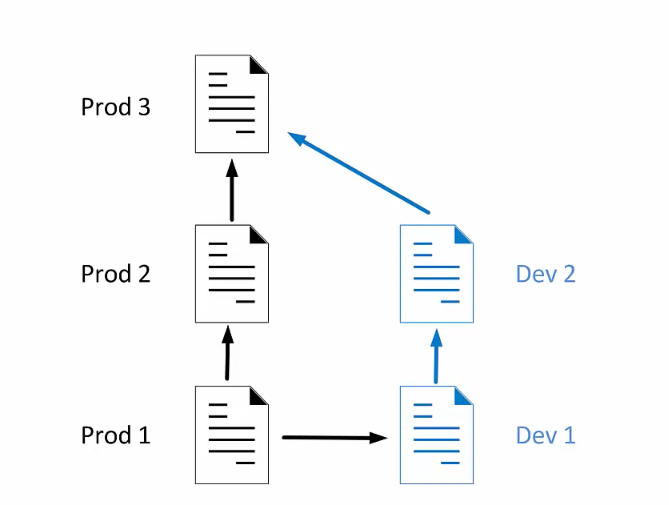

# 04-02: Branching and Merging

## Define Branches


Creating a `git tree` command to help us visualize. 
```
git config --global alias.tree "log --graph --decorate --pretty=oneline --abbrev-commit"
```

Or likewise, you can copy mine: (place it in your `~/.gitconfig` file)
```
[alias]
    tree = log --graph --full-history --all --color --date=short --pretty=format:\"%Cred%x09%h %Creset%ad%Cblue%d %Creset %s %C(bold)(%an)%Creset\"
```
## Create, Work On, and Delete Branches
You can use different names for branches. Here I am using `testdata` to represent files that we are going to test with the test data. `test` is just for random testing.
```
git branch testdata
git branch test
```

Alternatively, you can use
```
git checkout -b <newbranchname>
```
To create and checkout to the new branch at the same time.

You can use `git commit -a -m "commit message"` to add and stage commit all at once.

Once you merge the two branches, you can delete the old branch.
```
git branch --merged
git branch -d <mergedbranchname>
```
## HEAD pointer
`Head` is a pointer that points to the head of the branch.
### Detached HEAD
## Merge
### Fast-Forward
Move master branch directly to the target branch.
### 3-way
Master and auth are not on the same path.

Sometimes it doesn't come with conflicts, but if it does...
### Handle Conflicts
When you change the **same lines** in the same files, conflicts occur. 

```sh
git add .
git commit # will show the default commit message
```

## Git Stash
Store every modified files to another place. After that nothing occur in the current branch.
```
git stash
```
```
git stash list
```

Restore from the latest stash:
```sh
git stash apply
# or
git stash apply <stash@{<labelnumber>}>
```

```
git stash save "saving msg"
```


### Difference B/t `git stash apply` and `git stash pop`
Ref: <https://stackoverflow.com/questions/15286075/difference-between-git-stash-pop-and-git-stash-apply>

> Answers from the community:


`git stash pop` **throws away** the (topmost, by default) stash after applying it, whereas `git stash apply` **leaves it in the stash list** for possible later reuse (or you can then `git stash drop` it). 

This happens unless there are conflicts after `git stash pop`, in which case it will not remove the stash, leaving it to behave exactly like `git stash apply`.

Another way to look at it: `git stash pop` is `git stash apply && git stash drop`.
