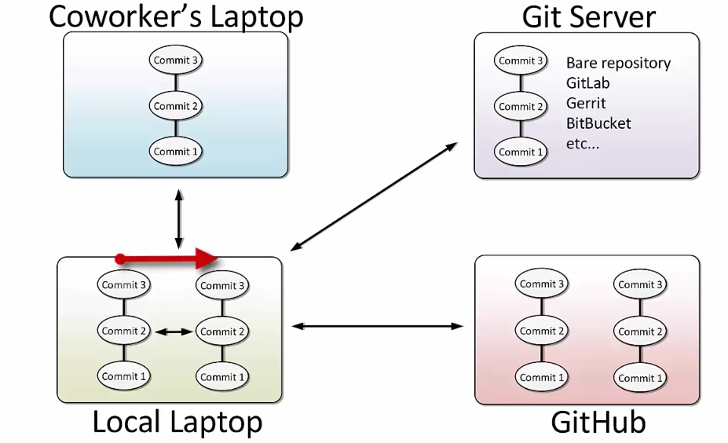
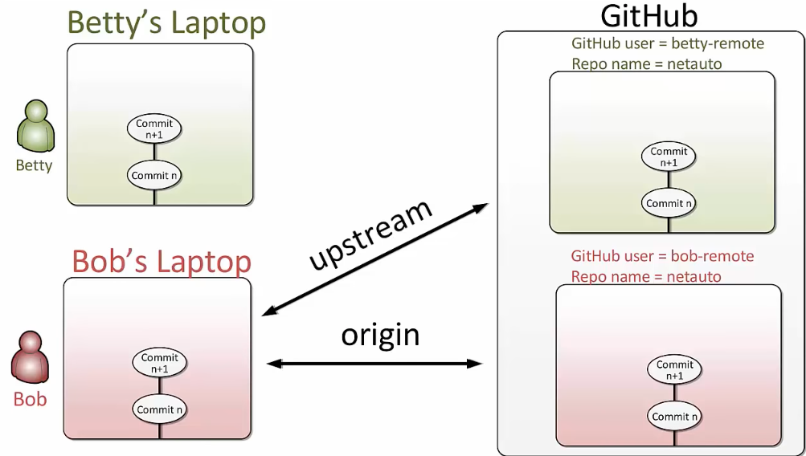

# 04-03: Remotes

## Git Remotes

 
## DIY
1. Create a Repo in GitHub
2. Clone a GitHub repo (using HTML option)
    ```
    git remote
    git remote -v
    ```
3. Fetch and Merge
    ```sh
    # method 1
    git fetch origin
    git merge origin/master

    # method 2
    git pull
    ```
4. Git Push
    ```sh
    git push # git push origin master
    ```

## GitHub Forks


```
git remote add upstream <remoteurl>
```

Staying in sync with the origin repository: (checking update from upstream instead of origin)
```sh
git fetch upstream
```
### Pull Requests
Used when you have new ideas or sources for the original repository.

We'll use GitHub to accomplish the task.